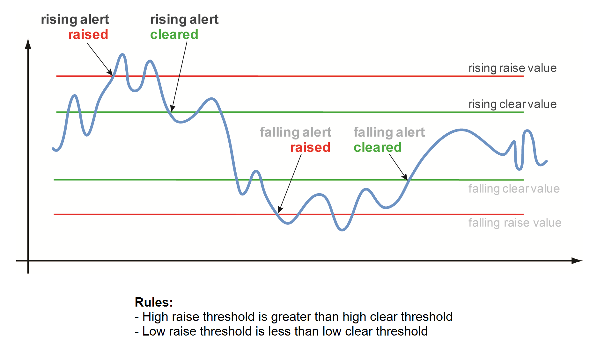

# GitHub Runners Observability Guidelines

> [!NOTE]
> This guidelines are an unreleased DRAFT

## Overview

PyTorch's CI infrastructure serves as the backbone for continuous integration across multiple cloud providers, supporting thousands of developers and contributors worldwide. The reliability of this infrastructure directly impacts PyTorch's development velocity, code quality, and release cadence. Without comprehensive monitoring, issues such as runner failures, performance degradation, or capacity bottlenecks can go undetected, leading to delayed builds, frustrated contributors, and potential release delays. Monitoring enables proactive identification of problems, ensures optimal resource utilization, and provides the data necessary for capacity planning and infrastructure optimization. This is especially critical given PyTorch's position as a leading machine learning framework where build reliability directly affects the broader AI/ML ecosystem.

This document defines the mandatory monitoring and observability requirements for GitHub runners added to the Pytorch multi-cloud CI infrastructure. All runners must comply with these guidelines to ensure proper tracking of health, performance, and availability.
This document is split into two parts --

1. [Requirements](#requirements) : which provides guidelines on `what` is reqired to onboard a new runner system and
2. [Implementation](#implementation) : which provides guidelines on `how` to fulfill the above requriements in a manner consisent with the rest of pytorch CI infra

## Requirements

### Runner Pool Stability

A candidate runner pool must:

- Undergo stability assessment before deployment in critical CI/CD workflows
- Maintain performance metrics during test jobs
- Track resource utilization and stability patterns
- Document baseline performance metrics for each runner type

### Incident Management

Runner pools must:

- Implement real-time status monitoring
- Configure automated alerts for:
  - Runner pool offline events
  - Capacity reduction incidents
  - Performance degradation
  - Resource exhaustion
- Establish alert routing to:
  - CI infrastructure team
  - Community maintainers
  - System administrators

### Metrics Requirements

All runners must collect and expose the following metrics on [hud.pytorch.org/metrics](https://hud.pytorch.org/metrics)

#### Lifecycle Metrics

Runners must track:

- Registration/unregistration events
- Job start/completion times
- Queue wait times
- Job execution duration
- Resource utilization during jobs
- Error rates and types

#### Health Metrics

Runners must monitor:

- Heartbeat status
- System resource usage (CPU, Memory, Disk)
- Network connectivity
- GitHub API response times
- Runner process health

## Technical Requirements

### OpenTelemetry Integration

All monitoring implementations must:

- Expose metrics in OpenTelemetry format
- Follow standardized metric naming conventions
- Use consistent labeling across all runners
- Implement proper metric aggregation and sampling

### Service Level Requirements

Production runners must maintain:

- Minimum uptime of 99.9%
- Maximum job queue time of 5 minutes
- Job execution time variance within ±10% of baseline
- Response time to critical alerts within 15 minutes
- Maximum capacity reduction of 10%

### Dashboard Requirements

### HUD Integration

The PyTorch CI HUD is a dashboard that consolidates metrics and dashboards for tracking the Continuous Integration (CI) system of PyTorch, including metrics related to runners.
The HUD provides a centralized view of these metrics, with dashboards like the Metrics Dashboard, Flambeau and Benchmark Metrics offering insights into runner performance and CI health

Teams providing runners to the pool must

- Implementing OpenTelemetry data source integration to HUD
- Support real-time status overview
- Support resource utilization graphs
- Alert history and status
- Runner pool capacity visualization

### Alternative Dashboards

Teams may implement:

- Grafana dashboard implementation
- Custom metrics visualization
- Alert management interface
- Performance reporting

### Documentation Requirements

Teams must:

- Maintain up-to-date monitoring documentation
- Doccuemnt the architecture diagram detailing their runner CI infrastructure setup
- Document all custom metrics, monitoring endpoints, and esclalation routes
- Document thresholds for raising and resolving alerts
- Document alert response procedures and playbooks for internal SRE/manitainers to follow to resolve the alerts
- Conduct regular review and updates of the documentation to prevent documentation from getting outdated

### Maintenance Requirements

Teams must:

- Conduct regular metric review
- Perform alert threshold tuning
- Optimize performance
- Plan for capacity

### Compliance Requirements

Teams must:

- Conduct regular review of monitoring effectiveness
- Perform quarterly metric analysis
- Update monitoring strategy annually
- Implement continuous improvement process

## Implementation

### System Architecture

In order to provide a clear separation between the pytorch foundation runners and community/partner runners, the following guidelines must be followed.
For details on getting started with onboarding a new runner, please refer to the [Partners Pytorch CI Runners](https://github.com/pytorch/test-infra/blob/main/docs/partners_pytorch_ci_runners.md) guide.

#### PyTorch Runners

Must implement:

- Dedicated monitoring namespace
- Resource quotas and limits
- Custom metrics for PyTorch-specific workloads
- Integration with existing PyTorch monitoring infrastructure

#### Community Runners

Must implement:

- Separate monitoring namespace
- Basic resource monitoring
- Job execution metrics
- Error tracking and reporting

### Alerting

All CI Runners should post alerts to [#pytorch-infra-alerts](https://pytorch.slack.com/archives/C082SHB006Q) channel in case of service degradation.

Teams must define clear alert thresholds as part of the runner [documentation requirements](#documentation-requirements)

Alerts may be of three types --

1. Raise `warning` alers when the expected values degrade below the P50 threshold nominal values
2. Raise `error` alerts when the expected values degrade below the P90 threshold nominal values
3. Raise `critical` alerts when the expected values degrade below the P99 threshold nominal values

Alerts need to have a raise threshold and a clear threshold defined.

In general the high raise threshold must be greater than the high clear threshold, and low raise threshold values would be less than the low clear threshold.
A common use case for high raise thresholds would be runner HTTP 5XX error rate, and low raise threshold would be metrics such as runner node disk space.

In addition to the above, for successfully managing alerts, teams must:

- Implement best-effort alert deduplication so as to reduce redundant posts in the channel
- Establish proper escalation paths for tagging maintainers.

### Metric Collection

Pytorch HUD uses a ClickHouse Cloud database as the data source for the dashboards, whose schema is defined [here](https://github.com/pytorch/test-infra/tree/main/clickhouse_db_schema).
All runners must publish metrics marked `mandatory` in the tables below.

> [!NOTE]
> TODO :: Fill in this section based on current state of metrics from WG meeting.