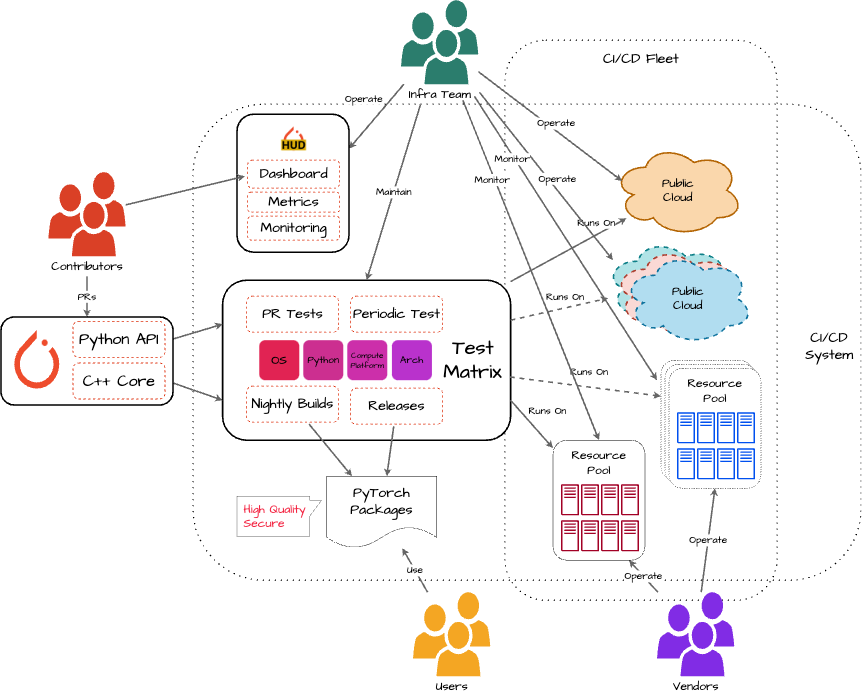
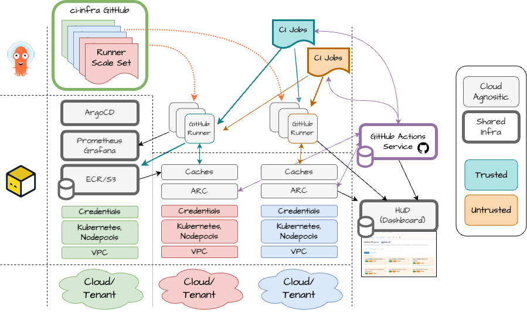

# PyTorch Multi-Cloud CI Working Group

This working group aims to remove technical limitations that exist today to ensure that any organisation interested in the PyTorch project may easily contribute to the infrastructure and testing of PyTorch in a way that is proportional to their interest and investment in the project.

Extending the CI/CD system to multiple clouds and removing barriers towards contributing infrastructure will enable a sustainable and equitable testing infrastructure for PyTorch.

Objectives of the group are:

* Develop a multi-cloud architecture with cloud-agnostic monitoring and observability in secure fashion
* Leverage credits so we maintain test coverage without increasing infrastructure spend 
* Extend the list of runner-providers so we improve test coverage without increasing infrastructure spend

The diagram below shows a high-level overview of the target state we want to achieve.

## Contacts

* Andrea Frittoli, IBM: Working Group Lead, GitHub: `afrittoli`
* Slack: [#tac-multicloud-wg](https://pytorch.slack.com/archives/C088Y6PKJ2Z)

## Proposed Architecture

The group is working on proposing a target architecture to expand the current CI/CD system to a multi-cloud fleet.
The proposal document is work in progress, and can be found in the [group cloud drive](https://docs.google.com/document/d/1hJZfphY9Yx8PafkIDibN0Mn9oxltwUgKQVdRkkMvZhk/edit?tab=t.451gmjcybsid).

The development of the proposal is organised in three streams of work:

* Stream 1: Focuses CI/CD Jobs and their infrastructure. Several CI/CD jobs today make assumptions about the availability of cloud-specific services, infrastructure and credentials, which renders them not portable. The infrastructure that CI/CD jobs rely on to consume and produce artifacts must be cloud-agnostic while minimising cross-region and cross-cloud bandwidth consumption.

* Stream 2: Focuses on monitoring and observability. The stream designs how metrics, logs, alerts and execution data may be produced by runners on various clouds, and efficiently collected centrally, to operate the multi-cloud fleet from a central dashboard.

* Stream 3: Focuses on provisioning of the infrastructure, autoscaling and scheduling of the CI/CD jobs. The existing autoscaler can run on AWS and provision AWS virtual machines. This stream looks into expanding provisioning and autoscaling of infrastructure to other clouds, and defining how jobs shall be scheduled to specific group of nodes in the fleet. 

## Guidelines

The working group has developed some draft guidelines with respect to securing and monitoring runner nodes (a node that is capable of executing a CI/CD job).

* [Security](https://github.com/pytorch-fdn/multicloud-ci-infra/blob/main/Security-Guidelines.md).
* [Monitoring](https://github.com/pytorch-fdn/multicloud-ci-infra/pull/13).

## Prototype

To validate the ideas from the proposed architecture, the group is building a prototype implementation, which benefits from [previous work](https://github.com/pytorch/ci-infra/tree/main/arc-backup-2024) done by the PyTorch infra team.
The prototype continues to use GitHub Actions to schedule jobs like today. It uses Kubernetes to provide a cloud-agnostic API, and [Action Runner Controller (ARC)](https://docs.github.com/en/actions/concepts/runners/actions-runner-controller) to define the fleet and manage provisioning and autoscaling of runners.

[Layered ToFu modules](https://github.com/pytorch/ci-infra/tree/main/arc/aws/391835788720/us-east-1) can be used to reproduce the same setup on top of Kubernetes running across clouds.
[ArgoCD](https://github.com/pytorch/ci-infra/tree/main/argocd) is used to maintain centrally the definition of the fleet configuration.

## Contributing

The working group welcomes contribution to the proposed architectures, to the guidelines as well as the prototype.

The working group has a [Slack Channel](https://pytorch.slack.com/archives/C088Y6PKJ2Z) on the PyTorch workspace. Meetings take place via Zoom every Monday at 10:30am PT/5:30pm UTC. They are open to everyone, the only prerequisite to join is having a [Linux Foundation account](https://identity.linuxfoundation.org). Please ping us on the slack channel to get an invite.
